# TOB- — To-B 企业级产品培训与仿真平台

> 包含两大子系统：**SkillQuest**（游戏化培训）+ **Omni-Sim**（数字孪生仿真）

---

## 在线演示（GitHub Pages）

| 地址 | 说明 |
|------|------|
| [https://wlqtjl.github.io/TOB-/](https://wlqtjl.github.io/TOB-/) | SkillQuest 展示页（showcase.html）自动部署 |
| [https://wlqtjl.github.io/TOB-/skillquest/brochure.html](https://wlqtjl.github.io/TOB-/skillquest/brochure.html) | 介绍手册页 |

> 每次向 `main` 分支推送时，GitHub Actions 自动将 showcase 与截图部署到  
> **GitHub Pages 远程分支**（即本仓库的 `github-pages` 环境，地址如上）。  
> 工作流文件：[`.github/workflows/deploy-pages.yml`](.github/workflows/deploy-pages.yml)

---

## 子项目

| 子项目 | 说明 | 详细文档 |
|--------|------|----------|
| [SkillQuest](SkillQuest/) | 游戏化产品技能培训平台（Next.js 15 + NestJS + AI） | [SkillQuest README](SkillQuest/README.md) |
| [Omni-Sim](omni-sim/) | 企业级 IT 基础设施数字孪生仿真平台（Rust ECS + Unity + TypeScript） | [Omni-Sim README](omni-sim/README.md) |

---

## 页面截图

👉 [查看 SkillQuest 全部 26 页截图](docs/screenshots.md)

| 首页 | 数据引力场 | 课程管理 |
|:---:|:---:|:---:|
| [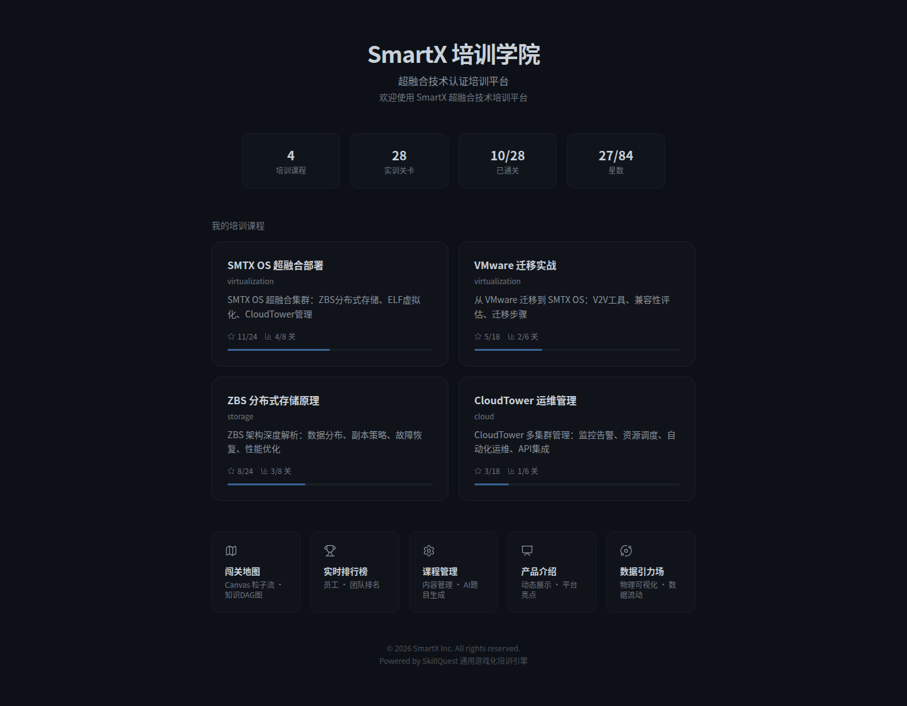](docs/screenshots.md#11-首页-) | [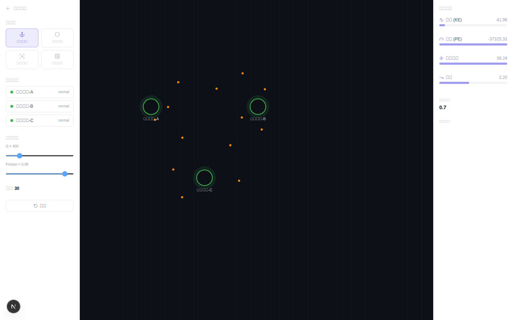](docs/screenshots.md#62-数据引力场-data-gravity) | [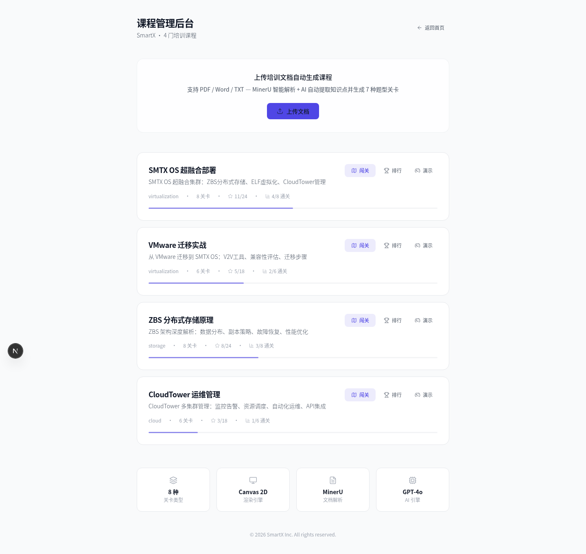](docs/screenshots.md#41-课程管理后台-courses) |

| 闯关地图 | 排行榜 | 关卡知识普及 |
|:---:|:---:|:---:|
| [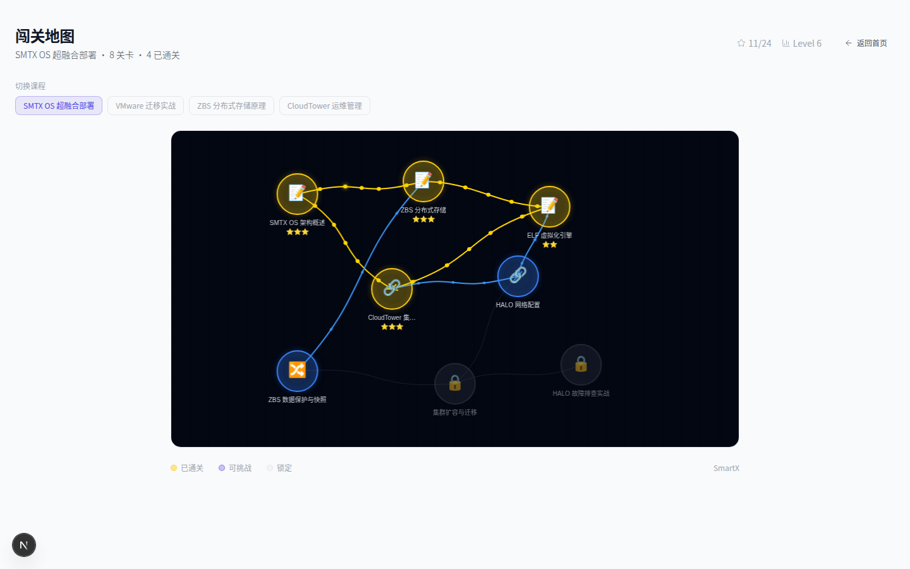](docs/screenshots.md#22-闯关地图-map) | [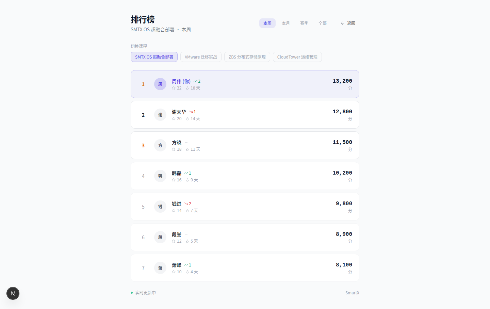](docs/screenshots.md#23-排行榜-leaderboard) | [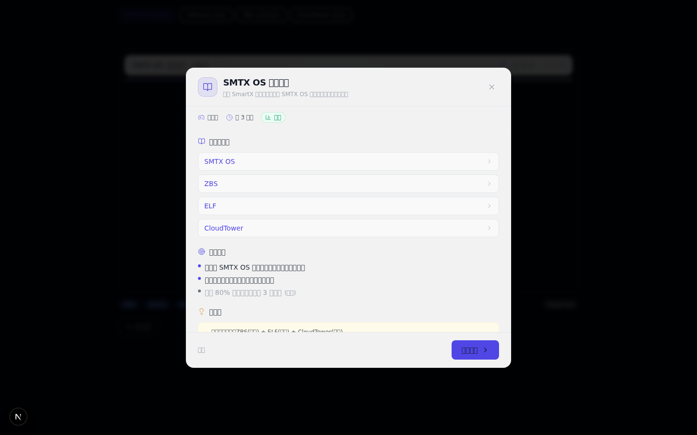](docs/screenshots.md#31-关卡知识普及-level1) |

| 关卡答题 | 专家复盘 | 产品介绍 |
|:---:|:---:|:---:|
| [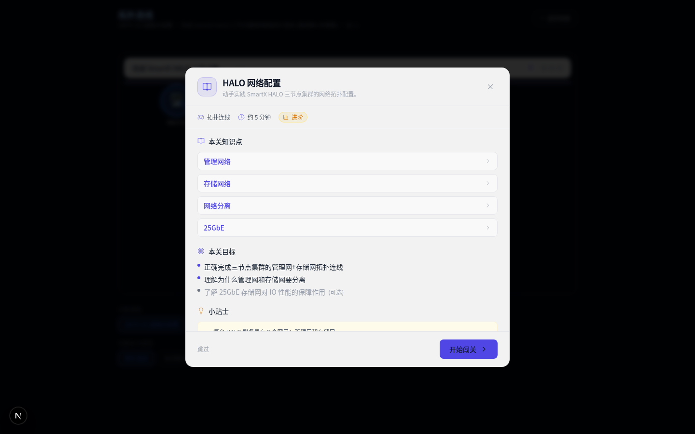](docs/screenshots.md#32-关卡答题-canvas-游戏界面) | [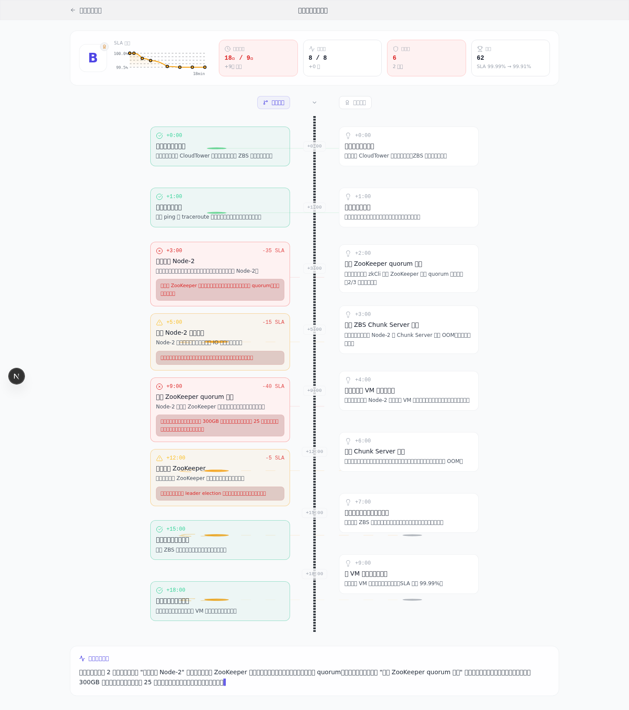](docs/screenshots.md#34-专家对比复盘-replay) | [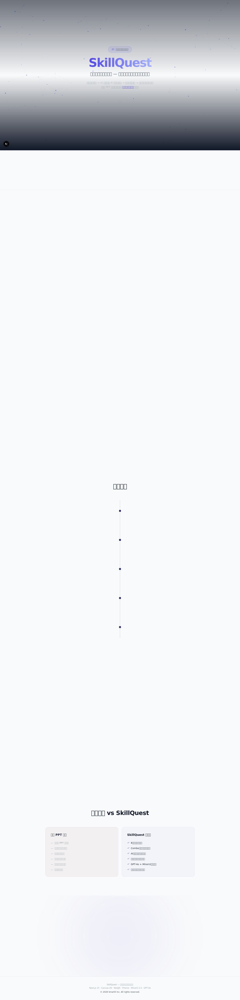](docs/screenshots.md#61-产品介绍-showcase) |

---

## 技术架构概览

### SkillQuest 技术栈

| 层级 | 技术 | 用途 |
|------|------|------|
| 前端框架 | Next.js 15 (App Router) | SSR + 路由 |
| 游戏引擎 | Canvas 2D + 自研粒子引擎 | 8 种关卡渲染 + Combo 连击 |
| 动画系统 | Framer Motion + Canvas 2D + SVG + Web Audio | 35+ 动画组件 · 19 种状态动画映射 |
| 物理引擎 | 万有引力(F=GMm/r²) + 碰撞检测 + 粒子物理 | 数据引力场 · 布朗运动 · 波动方程 |
| UI 设计 | Tailwind CSS + Lucide React | 极简毛玻璃设计系统 |
| 后端框架 | NestJS 10 | REST API + WebSocket |
| 数据库 | PostgreSQL 16 + Prisma ORM | 业务数据 + 向量存储 |
| 缓存/排行 | Redis 7 | Sorted Set 排行榜 |
| AI 引擎 | FastAPI + GPT-4o + MinerU 2.5 | RAG 检索 + 题目生成 |
| 构建工具 | Turborepo + pnpm | Monorepo 管理 |

### Omni-Sim 技术栈

| 层级 | 技术 | 用途 |
|------|------|------|
| 核心引擎 | Rust (hecs ECS) | 仿真状态机 + 确定性哈希 |
| 编译目标 | Wasm (wasm32-unknown-unknown) | 跨平台部署 |
| 数据格式 | OPDL 编译器 | 厂商设备描述语言 |
| 三维展示 | Unity 6 LTS | GPU Instancing 渲染 |
| Web 控制台 | TypeScript + Vite | 实时 Telemetry 面板 |
| 部署 | Docker Compose + Nginx | WebSocket + 静态文件 |

---

## 🎨 动画与视觉效果核心架构

> SkillQuest 拥有 **35+ 个动画/视觉组件**，横跨 5 大渲染技术栈，构成完整的沉浸式游戏化培训体验。

### 动画引擎分层架构图

> 下图为预渲染 SVG，始终可见（GitHub 客户端 Mermaid 在节点数较多时会卡在 "Loading"，故改用静态图）。若修改了本节下方的 Mermaid 源码，需同步重新生成 [`docs/animation-architecture.svg`](docs/animation-architecture.svg)。

[](docs/animation-architecture.svg)

<details>
<summary>📜 查看 Mermaid 源码（便于后续编辑 / 本地渲染）</summary>

```mermaid
graph TB
    subgraph "🎮 用户交互层"
        A1["🖱️ 鼠标/触控事件"]
        A2["⌨️ 键盘输入"]
        A3["📱 手势识别"]
    end

    subgraph "🏗️ 游戏引擎层 — packages/game-engine"
        B1["📋 animation-catalog.ts<br/>19 种状态→动画映射<br/>节点离线/恢复/过载/数据迁移..."]
        B2["⚙️ physics-engine.ts<br/>粒子物理 · 热力图 · 呼吸动画<br/>震动衰减 · X光模式"]
        B3["🌌 core-physics-engine.ts<br/>牛顿万有引力 F=GMm/r²<br/>多普勒色偏 · 碰撞检测 · 反亲和力"]
        B4["🔫 gravity-gun-controller.ts<br/>引力锚 · 力场护盾<br/>透镜 · 奇点脉冲"]
        B5["🔧 tool-system.ts<br/>6 种语义工具<br/>Probe/Cutter/Booster/Linker/Migrator/Freezer"]
        B6["🌉 tool-visual-bridge.ts<br/>工具→动画桥接<br/>19 种动画效果映射"]
        B7["🗺️ visual-scene.ts<br/>VisualScene 协议<br/>通用渲染抽象层"]
        B8["🔄 world-state.ts<br/>WorldState 沙箱<br/>纯函数状态转换"]
    end

    subgraph "🎨 Canvas 2D 渲染层 — components/game"
        C1["🎬 UniversalGameRenderer<br/>通用 Canvas 渲染器<br/>网格 · 实体 · 连线 · 粒子"]
        C2["✨ ParticleSystem<br/>对象池粒子引擎<br/>500流动+200爆发 · Bézier路径<br/>轨迹拖尾 · 形状(圆/方/菱)"]
        C3["📐 EntityRenderer<br/>圆形/圆角矩形 · 辉光<br/>图标渲染 · 星级显示"]
        C4["🔗 ConnectionRenderer<br/>Bézier 曲线 · 箭头<br/>虚线动画 · 高亮"]
        C5["💥 FeedbackEffects<br/>答对: 绿色闪屏+粒子爆发<br/>答错: 15Hz震动+红色闪屏<br/>通关: 五点烟花+金色涟漪"]
        C6["🔁 useParticleLoop<br/>RAF 动画循环<br/>DPI缩放 · dt上限50ms"]
    end

    subgraph "🌟 Framer Motion 动画层 — components/game"
        D1["🏆 VictoryEffects<br/>Canvas烟花 + Web Audio和弦<br/>C5-E5-G5琶音 · 星星弹入<br/>12色粒子 · 重力模拟"]
        D2["⚠️ StoryIntroPage<br/>危机警报三阶段动画<br/>打字机日志 · 红色脉冲边框<br/>倒计时紧张感"]
        D3["⚡ SprintMode<br/>5分钟冲刺倒计时<br/>题目滑入/滑出 · 连击徽章<br/>星级旋转弹入"]
        D4["📊 LeaderboardToast<br/>弹簧弹入通知<br/>damping:20 stiffness:300<br/>自动消失 · 排名变动"]
        D5["🤖 AIHintPanel<br/>苏格拉底导师面板<br/>打字指示器 · 提示渐入<br/>鼓励/引导切换"]
        D6["🗺️ ZBSFlowViz<br/>五场景叙事动画<br/>数据分块 · 节点故障震动<br/>副本策略 · 读路径选择"]
        D7["🎮 ScenarioGameRenderer<br/>选择卡片动画<br/>进度条填充 · 后果揭示"]
        D8["📊 StandardFlowGenerator<br/>通用数据流模板<br/>参数化场景动画"]
    end

    subgraph "📈 SVG 可视化层"
        E1["📉 SLACurve<br/>二次Bézier平滑曲线<br/>渐变填充 · 网格参考线<br/>红/黄/绿阈值着色"]
        E2["⏱️ ExpertComparisonTimeline<br/>双轨垂直时间线<br/>偏离分支 · 辉光节点"]
        E3["🔘 TimelineNode<br/>状态辉光圆<br/>correct/warning/error<br/>震动动画(error)"]
    end

    subgraph "🔬 物理仿真沙箱层 — components/sandbox"
        F1["🌊 WaveEngine<br/>正弦波渲染<br/>双波源干涉 · 阈值警报"]
        F2["⚛️ ParticleSystem (sandbox)<br/>布朗运动 · 弹性碰撞<br/>温度缩放 · 压力边界"]
        F3["🧲 VectorField<br/>三种力场(引力/电场/流场)<br/>箭头网格 · 相位动画"]
        F4["🔌 LogicGate<br/>6种逻辑门(AND/OR/NOT...)<br/>SVG路径动画 · 信号着色"]
    end

    subgraph "🌍 数据引力可视化 — app/data-gravity"
        G1["🌌 DataGravity 交互页<br/>Canvas 2D 物理沙箱<br/>3个存储节点 · 多普勒色偏<br/>引力常数G可调 · 能量监控"]
        G2["📖 DataGravity 故事模式<br/>五场景叙事引导<br/>ZBSFlowViz 交互学习"]
    end

    A1 --> C1
    A2 --> D3
    A3 --> G1

    B1 --> B6
    B5 --> B6
    B6 --> C5
    B7 --> C1
    B8 --> B1
    B3 --> G1
    B4 --> G1
    B2 --> C1

    C1 --> C2
    C1 --> C3
    C1 --> C4
    C1 --> C5
    C6 --> C1
    C6 --> G1

    D1 --> C2
    D6 --> D8

    style B1 fill:#1e293b,stroke:#60a5fa,color:#fff
    style B3 fill:#1e293b,stroke:#a78bfa,color:#fff
    style C2 fill:#064e3b,stroke:#34d399,color:#fff
    style D1 fill:#7c2d12,stroke:#fb923c,color:#fff
    style D2 fill:#7f1d1d,stroke:#f87171,color:#fff
    style G1 fill:#312e81,stroke:#818cf8,color:#fff
```

重新生成命令：

```bash
# 从 README 第 ### 动画引擎分层架构图 下方提取 mermaid 源 → diagram.mmd
npx -y @mermaid-js/mermaid-cli -i diagram.mmd -o docs/animation-architecture.svg
```

</details>

### 动画技术栈分布

| 渲染技术 | 组件数 | 核心能力 | 代表组件 |
|---------|--------|---------|---------|
| **Canvas 2D** | 18 | 高性能粒子系统、物理仿真、实体渲染、连线动画 | UniversalGameRenderer, ParticleSystem, DataGravity |
| **Framer Motion** | 10 | UI 过渡动画、弹簧物理、手势响应、布局动画 | VictoryEffects, StoryIntroPage, SprintMode, ZBSFlowViz |
| **SVG** | 4 | 矢量曲线、时间线节点、逻辑门电路 | SLACurve, ExpertComparisonTimeline, LogicGate |
| **Web Audio API** | 1 | 合成音频反馈（胜利和弦 C5-E5-G5） | VictoryEffects |
| **CSS/Tailwind** | 全局 | 毛玻璃效果、渐变、脉冲、发光阴影 | GameHUD, LeaderboardToast |

### 完整动画组件清单（35+ 文件）

<details>
<summary>📂 展开查看全部动画组件</summary>

#### 🏗️ 游戏引擎核心（packages/game-engine/src/）

| 文件 | 动画类型 | 关键技术 |
|------|---------|---------|
| `animation-catalog.ts` | 19 种状态→动画映射 | 触发器模式匹配、优先级排序、通配符支持 |
| `physics-engine.ts` | 粒子物理、热力图、呼吸动画 | 颜色插值 `loadToColor()`、0.5Hz/2Hz 脉冲、震动衰减 |
| `data-gravity/core-physics-engine.ts` | 万有引力 F=GMm/r² | 多普勒色偏、碰撞检测(CoR=0.8)、反亲和力、摩擦阻尼 |
| `data-gravity/gravity-gun-controller.ts` | 4 种交互工具 | 引力锚(mass=5000)、力场护盾、透镜(120px)、奇点脉冲(50000) |
| `data-gravity/node-manager.ts` | 节点状态管理 | 存储节点/数据粒子/锚点/护盾生命周期 |
| `data-gravity/energy-monitor.ts` | 能量追踪 | 动能/势能/熵增实时计算 |
| `tool-system.ts` | 6 种语义工具 | Probe/Cutter/Booster/Linker/Migrator/Freezer |
| `tool-visual-bridge.ts` | 工具→动画桥接 | 19 种效果映射到 Canvas 渲染 |
| `visual-scene.ts` | VisualScene 协议 | 实体/连线/粒子/交互规则抽象 |
| `world-state.ts` | 状态沙箱 | 纯函数状态转换 + PRNG(Mulberry32) |

#### 🎨 Canvas 2D 渲染器（apps/web/src/components/game/）

| 文件 | 动画类型 | 关键技术 |
|------|---------|---------|
| `UniversalGameRenderer.tsx` | 通用 Canvas 渲染器 | 50px 网格、DPI 缩放、RAF 循环、dt 上限 50ms |
| `ParticleSystem.ts` | 对象池粒子引擎 | 500 流动 + 200 爆发粒子、Bézier 路径跟随、轨迹拖尾 |
| `EntityRenderer.ts` | 实体渲染 | 圆形/圆角矩形、辉光 shadowBlur(2.5×)、图标+标签 |
| `ConnectionRenderer.ts` | 连线渲染 | Bézier 曲线、箭头旋转、虚线 `[6,4]`、高亮 #22c55e |
| `FeedbackEffects.ts` | 答题反馈 | 正确:绿闪(0.15α)+爆发、错误:15Hz震动+红闪、通关:5点烟花+金涟漪 |
| `InteractionManager.ts` | 交互管理 | 点击/连线/拖拽/序列/输入 5 种模式 |
| `InsightPanel.tsx` | 打字机动画 | 逐字显示（30ms/字） |
| `GameHUD.tsx` | 毛玻璃 HUD | Combo 阶梯(Good/Great/Amazing/Legendary) + 火焰动画 |

#### 🌟 Framer Motion 组件（apps/web/src/components/game/）

| 文件 | 动画类型 | 关键技术 |
|------|---------|---------|
| `VictoryEffects.tsx` | 三重感官反馈 | Canvas 烟花(12色/60粒子/重力0.05)、Web Audio 和弦(C5-E5-G5)、Framer 弹入 |
| `StoryIntroPage.tsx` | 危机叙事入场 | 三阶段(警告→日志→简报)、打字机(400ms/行)、红色脉冲边框(2s循环) |
| `SprintMode.tsx` | 冲刺倒计时 | 数字缩放(2→1)、题目滑动(±50px)、进度条变色(绿→黄→红) |
| `LeaderboardToast.tsx` | 排名通知弹窗 | 弹簧(damping:20, stiffness:300)、popLayout 重排、自动消失 |
| `AIHintPanel.tsx` | AI 导师面板 | 面板弹入(scale:0.95→1)、打字指示器(bounce)、提示渐入 |
| `ZBSFlowViz.tsx` | 五场景叙事 | 数据分块动画、节点故障震动(0.4s×2)、副本策略滑块、读路径交互 |
| `ScenarioGameRenderer.tsx` | 情景选择 | 选择卡片变色(emerald/red)、后果揭示缩放 |
| `StandardFlowGenerator.tsx` | 通用数据流 | DataFlowTemplate 参数化、场景切换动画 |
| `LevelIntroModal.tsx` | 关卡入场 | 模态弹入 + 叙事文本动画 |
| `NarrativeModal.tsx` | 叙事对话 | 消息逐条显示、频道切换 |

#### 📈 SVG 可视化（apps/web/src/components/game/）

| 文件 | 动画类型 | 关键技术 |
|------|---------|---------|
| `SLACurve.tsx` | SLA 曲线 | 二次 Bézier `Q cpx py x y`、渐变填充(0.15→0.02)、红/黄/绿阈值 |
| `ExpertComparisonTimeline.tsx` | 双轨时间线 | SVG 垂直布局、GitBranch 偏离标注、等级徽章(A/S/B/C/D) |
| `TimelineNode.tsx` | 时间线节点 | 辉光圆(shadow 12-16px)、状态着色(emerald/amber/red)、error 震动 |

#### 🔬 物理仿真沙箱（apps/web/src/components/sandbox/）

| 文件 | 动画类型 | 关键技术 |
|------|---------|---------|
| `WaveEngine.tsx` | 正弦波渲染 | `y = A·sin(x·f·0.02 + t·s)`、双波源干涉、阈值警报(红背景) |
| `ParticleSystem.tsx` | 布朗运动 | 随机速度(±1.5×speedFactor)、弹性碰撞、温度缩放 √(T/300) |
| `VectorField.tsx` | 矢量力场 | 3 种场(引力/电场/流场)、箭头网格、相位动画 |
| `LogicGate.tsx` | 逻辑门电路 | 6 种门(AND/OR/NOT/XOR/NAND/BUFFER)、pathLength 0→1 动画 |
| `SimulationCanvas.tsx` | 引擎路由 | wave/particle/vector_field/logic_gate 四引擎分发 |
| `ParameterPanel.tsx` | 参数控制 | 实时滑块调节物理参数 |
| `FormulaDisplay.tsx` | 公式渲染 | KaTeX 数学公式实时更新 |

#### 🌍 数据引力页面（apps/web/src/app/data-gravity/）

| 文件 | 动画类型 | 关键技术 |
|------|---------|---------|
| `page.tsx` (data-gravity) | 2D 物理沙箱 | 3 存储节点、多普勒色偏、引力常数 G 可调(默认400)、摩擦 0.98 |
| `story/page.tsx` | 故事模式 | ZBSFlowViz 五场景叙事引导 |

</details>

### 19 种动画效果目录（animation-catalog.ts）

```
状态触发器                    → 动画效果组合
──────────────────────────────────────────────
节点离线 (offline)            → fade_out + spark
节点重启 (rebooting)          → pulse + progress_bar
节点恢复 (recovered)          → fade_in + burst + ripple
节点降级 (degraded)           → blink
节点过载 (overloaded)         → heat_map + pulse
节点维护 (maintenance)        → blink
链路分区 (link-partitioned)   → connection_break + spark
链路降级 (link-degraded)      → blink
链路恢复 (link-recovered)     → merge + ripple
数据再平衡 (data-rebalance)   → flow_redirect + trail
数据丢失 (data-loss)          → data_scatter + shake
数据迁移 (data-migration)     → trail + progress_bar
选举共识 (consensus-election) → ripple + highlight
灾难爆炸 (disaster-explosion) → explosion + shake + countdown
级联故障 (disaster-cascading)  → spark + fade_out
```

---

## 快速开始

### SkillQuest（最快体验 — 仅前端）

```bash
cd SkillQuest
npm install -g pnpm@9.1.0
pnpm install
pnpm --filter @skillquest/web dev
# → 打开 http://localhost:3000 即可闯关（内置 Mock 数据，无需后端）
```

### Omni-Sim

```bash
cd omni-sim
cargo test --workspace       # 运行全部测试
./build/build_wasm.sh        # 编译 Wasm → Unity
```

详细说明请参阅各子项目 README。

---

## 完整 PR 变更记录（#1 — #22）

> 以下是本仓库从创建至今全部已合并 PR 的完整记录，按时间顺序排列。

### Phase 0：Omni-Sim 基础建设（PR #1 — #4）

| PR | 日期 | 标题 | 关键变更 |
|----|------|------|----------|
| [#1](https://github.com/wlqtjl/TOB-/pull/1) | 2026-04-09 | Extract 游戏攻关2.0.tar.gz into repository | 解压 `omni-sim/` 项目：Rust workspace（5 个 crate: core/ffi/headless/opdl/telemetry）、Unity 集成脚本、CI 工作流、厂商 Pack、42 个新文件 |
| [#2](https://github.com/wlqtjl/TOB-/pull/2) | 2026-04-09 | fix: production-readiness defects (C-01–C-04, H-01–H-07, M/L tier) | 修复 20 个生产级缺陷：状态哈希确定性(C-01)、FFI 内存安全(C-02)、OPDL 编译器三阶段流水线(C-03)、Telemetry WebSocket 推送(C-04)、运行时稳定性(H-01–H-07) |
| [#3](https://github.com/wlqtjl/TOB-/pull/3) | 2026-04-09 | Add comprehensive test coverage across all crates (46 → 139 tests) | 测试覆盖从 46 增至 139：补全 omni-sim-ffi 和 omni-sim-headless 的零测试缺口、覆盖 validator 全部 12 种错误变体 |
| [#4](https://github.com/wlqtjl/TOB-/pull/4) | 2026-04-10 | feat: add --serve mode for live WebSocket telemetry deployment | 新增 `--serve` 模式：Rust ECS 仿真 → WebSocket 遥测 → TypeScript Web Console 仪表板全链路部署；Docker Compose 支持 |

### Phase 1：SkillQuest 安全与渲染引擎（PR #5 — #8）

| PR | 日期 | 标题 | 关键变更 |
|----|------|------|----------|
| [#5](https://github.com/wlqtjl/TOB-/pull/5) | 2026-04-11 | fix(security): upgrade next 14.2.35 → 15.x to patch HTTP request deserialization DoS | 修复 Next.js HTTP 请求反序列化 DoS 漏洞（CVE 影响 ≥13.0.0, <15.0.8）；升级到 Next.js 15 稳定版 |
| [#6](https://github.com/wlqtjl/TOB-/pull/6) | 2026-04-11 | feat: VisualScene protocol — universal Canvas rendering engine | 统一 Canvas 2D 渲染引擎替代逐类型 SVG 渲染；VisualScene 协议支持 8 种关卡类型的通用渲染管线 |
| [#7](https://github.com/wlqtjl/TOB-/pull/7) | 2026-04-11 | Resolving architectural gaps in game engine's visual layer | 修复游戏引擎可视化层架构缺口 |
| [#8](https://github.com/wlqtjl/TOB-/pull/8) | 2026-04-11 | Fix 9 architectural defects in game engine visual layer | 修复 9 个架构缺陷：ScoreResult.stars 类型安全、内存泄漏、硬编码假设等 |

### Phase 2：AI 出题 + 流程仿真（PR #9 — #11）

| PR | 日期 | 标题 | 关键变更 |
|----|------|------|----------|
| [#9](https://github.com/wlqtjl/TOB-/pull/9) | 2026-04-11 | feat: document upload → GPT-4o AI course generation pipeline | 激活文档上传 → AI 课程生成流水线：PDF/DOCX/TXT 上传 → MinerU 智能解析 → GPT-4o 自动生成 7 种题型关卡 |
| [#10](https://github.com/wlqtjl/TOB-/pull/10) | 2026-04-12 | feat: FLOW_SIM level type — doc-to-playable-game pipeline (3-phase) | 新增 FLOW_SIM 关卡类型：将不可见的系统内部流程（如 ZBS 分布式块存储元数据管理）转化为可视化交互游戏关卡 |
| [#11](https://github.com/wlqtjl/TOB-/pull/11) | 2026-04-12 | Fix TS lint errors and migrate web from deprecated next lint to ESLint CLI | 修复 API 8 个 TypeScript 编译错误；迁移 Web 从废弃的 `next lint` 到 ESLint CLI |

### Phase 3：展示与品牌设计（PR #12 — #14）

| PR | 日期 | 标题 | 关键变更 |
|----|------|------|----------|
| [#12](https://github.com/wlqtjl/TOB-/pull/12) | 2026-04-12 | Add standalone HTML showcase with animations and synthesized audio | 创建独立 HTML 展示页（`showcase.html`）：动画 + 合成音频，可离线打开，无需运行开发服务器 |
| [#13](https://github.com/wlqtjl/TOB-/pull/13) | 2026-04-12 | Add PDF brochure for sharing SkillQuest showcase with SmartX leadership | 创建 PDF 手册（`SkillQuest-介绍手册.pdf`）：供微信/钉钉分享给 SmartX 管理层，避免 HTML 附件被邮件过滤 |
| [#14](https://github.com/wlqtjl/TOB-/pull/14) | 2026-04-12 | Minimalist UI redesign: Lucide icons, single-accent color system, frosted glass | 全站 UI 重构：从 emoji 多渐变风格 → 极简/科技冷感设计（对标 Linear.app + Apple）；Lucide 图标、单色调、毛玻璃效果 |

### Phase 4：AI 校验 + 游戏引擎深度功能（PR #15 — #19）

| PR | 日期 | 标题 | 关键变更 |
|----|------|------|----------|
| [#15](https://github.com/wlqtjl/TOB-/pull/15) | 2026-04-12 | RAG question engine, multi-agent validation, WorldState sandbox, universal animation catalog | RAG 管道（chunker→embedder→retriever）、生成器-求解器双代理校验、WorldState 沙箱（纯函数）、19 种通用动画映射、数据库审核字段（reviewStatus/feedbackLog） |
| [#16](https://github.com/wlqtjl/TOB-/pull/16) | 2026-04-12 | RAG BM25 fallback, configurable Solver model, deterministic executeActionPure, path-based detectChanges | BM25 文本检索备用方案（替代零向量降级）、Agent B 模型可配置、executeActionPure 支持确定性 PRNG（Mulberry32 种子）、detectChanges 路径索引优化（O(n²)→O(1)） |
| [#17](https://github.com/wlqtjl/TOB-/pull/17) | 2026-04-12 | feat: Expert Comparison Timeline — vertical dual-track deviation map | 专家对比复盘视图：垂直双轨时间线、SLA 下降曲线、玩家路径 vs 专家最优路径对比、偏离点标注 |
| [#18](https://github.com/wlqtjl/TOB-/pull/18) | 2026-04-12 | feat: ToolSystem, PhysicsEngine, ToolVisualBridge — hardcore simulation interaction | 硬核仿真交互系统：6 种语义工具（Probe/Cutter/Booster/Linker/Migrator/Freezer）、粒子物理引擎、工具→动画桥接、ZBS 副本救援场景 |
| [#19](https://github.com/wlqtjl/TOB-/pull/19) | 2026-04-12 | feat: Data Gravity 2D physics interaction system | 数据引力物理系统：CorePhysicsEngine（F=GMm/r²）、NodeManager（质量=100×容量×带宽）、GravityGunController（4 种工具）、EnergyMonitor（动能/势能/熵增）；98 个测试 |

### Phase 5：知识普及 + 前端补全 + 截图修复（PR #20 — #22）

| PR | 日期 | 标题 | 关键变更 |
|----|------|------|----------|
| [#20](https://github.com/wlqtjl/TOB-/pull/20) | 2026-04-13 | feat: add pre-game level briefing system (关卡前知识普及) | 关卡前知识普及模态框（LevelBriefingModal）：知识点展开、通关目标、小贴士；修复 levelId 格式不匹配（URL 用 '1'，数据用 'l1'） |
| [#21](https://github.com/wlqtjl/TOB-/pull/21) | 2026-04-13 | feat: add DataGravity physics visualization page | 7 大功能模块完整性验证（43+ 文件）；268 个游戏引擎测试通过；DataGravity Canvas 2D 可视化前端页面（/data-gravity）；首页导航 + Showcase 更新为「七大核心能力」；遗漏模式分析 |
| [#22](https://github.com/wlqtjl/TOB-/pull/22) | 2026-04-13 | fix: 修复截图不可点击问题 — 第一性原理根治 | 根因：`user-attachments/assets/` URL 重定向到 5 分钟过期 S3 签名 URL；修复：截图存入 `docs/screenshots/` 永久资产 + `[](path)` 可点击语法；更新 README 缩略图网格 |

### Phase 6：持续部署（PR #23 — ）

| PR | 日期 | 标题 | 关键变更 |
|----|------|------|----------|
| 当前 | 2026-04-14 | feat: GitHub Pages 自动部署（回答"远程分支在哪里"） | 新增 `.github/workflows/deploy-pages.yml`：每次推送到 `main` 分支自动将 showcase + docs/screenshots 部署到 **GitHub Pages**（[https://wlqtjl.github.io/TOB-/](https://wlqtjl.github.io/TOB-/)），这就是"远程分支"的公开访问地址 |

---

## 功能模块完整清单

### SkillQuest — 7 大功能模块 + 沉浸式冒险系统

| 模块 | 核心文件 | PR | 测试数 |
|------|----------|-----|--------|
| 硬核仿真交互系统 | tool-system.ts, physics-engine.ts, tool-visual-bridge.ts, zbs-replica-rescue.ts | [#18](https://github.com/wlqtjl/TOB-/pull/18) | 69 |
| 数据引力物理系统 | data-gravity/core-physics-engine.ts, node-manager.ts, gravity-gun-controller.ts, energy-monitor.ts, vec2.ts | [#19](https://github.com/wlqtjl/TOB-/pull/19) [#21](https://github.com/wlqtjl/TOB-/pull/21) | 98 |
| AI 出题校验 + RAG 管道 | rag/chunker.py, embedder.py, bm25.py, retriever.py, question-validator.service.ts | [#9](https://github.com/wlqtjl/TOB-/pull/9) [#15](https://github.com/wlqtjl/TOB-/pull/15) [#16](https://github.com/wlqtjl/TOB-/pull/16) | 49 (Python) |
| 数据库审核/反馈字段 | schema.prisma (Level.reviewStatus, DocumentChunk, QuestionValidationLog, IncidentReport) | [#15](https://github.com/wlqtjl/TOB-/pull/15) | — |
| Canvas 动画通用化 | animation-catalog.ts (19 种动画), world-state.ts, world-state-visual-bridge.ts | [#6](https://github.com/wlqtjl/TOB-/pull/6) [#15](https://github.com/wlqtjl/TOB-/pull/15) | 79 |
| 关卡前知识普及 | LevelBriefingModal.tsx, briefing-data.ts | [#20](https://github.com/wlqtjl/TOB-/pull/20) | — |
| 专家对比复盘 | ExpertComparisonTimeline.tsx, SLACurve.tsx, TimelineNode.tsx, replay/page.tsx | [#17](https://github.com/wlqtjl/TOB-/pull/17) | — |
| 🆕 沉浸式冒险系统 | StoryIntroPage.tsx, VictoryEffects.tsx, SprintMode.tsx, LeaderboardToast.tsx, AIHintPanel.tsx | 当前 PR | — |

### SkillQuest — 8 种关卡类型

| 类型 | 说明 | 首次引入 |
|------|------|----------|
| 拓扑连线 (topology) | 拖拽构建网络拓扑图 | 初始版本 |
| 知识配对 (matching) | 组件功能一对一匹配 | 初始版本 |
| 步骤排序 (ordering) | 操作流程正确排序 | 初始版本 |
| 选择题 (quiz) | 知识点快速测验 | 初始版本 |
| 命令行 (terminal) | 真实 CLI 命令模拟 | 初始版本 |
| 故障排查 (scenario) | 场景化排障实战 | 初始版本 |
| VM 调度 (vm_placement) | 虚拟机智能放置 | 初始版本 |
| 流程仿真 (flow_sim) | 分布式系统流程模拟 | [#10](https://github.com/wlqtjl/TOB-/pull/10) |

### Omni-Sim — 5 个 Rust Crate

| Crate | 说明 | PR |
|-------|------|----|
| omni-sim-opdl | 组件类型 + OPDL 编译器（零上游依赖） | [#1](https://github.com/wlqtjl/TOB-/pull/1) [#2](https://github.com/wlqtjl/TOB-/pull/2) |
| omni-sim-core | ECS 系统 + 状态哈希 | [#1](https://github.com/wlqtjl/TOB-/pull/1) [#2](https://github.com/wlqtjl/TOB-/pull/2) |
| omni-sim-ffi | C ABI / Wasm FFI 层 | [#1](https://github.com/wlqtjl/TOB-/pull/1) [#3](https://github.com/wlqtjl/TOB-/pull/3) |
| omni-sim-telemetry | 采样 + WebSocket 推送 | [#1](https://github.com/wlqtjl/TOB-/pull/1) [#2](https://github.com/wlqtjl/TOB-/pull/2) |
| omni-sim-headless | CLI 无头服务器 + `--serve` 模式 | [#1](https://github.com/wlqtjl/TOB-/pull/1) [#3](https://github.com/wlqtjl/TOB-/pull/3) [#4](https://github.com/wlqtjl/TOB-/pull/4) |

---

## 测试覆盖

| 子系统 | 框架 | 测试数 | 运行命令 |
|--------|------|--------|----------|
| Omni-Sim (Rust) | cargo test | 139 | `cd omni-sim && cargo test --workspace` |
| SkillQuest 游戏引擎 (TS) | Vitest | 268 | `cd SkillQuest/packages/game-engine && npx vitest run` |
| SkillQuest AI 引擎 (Python) | pytest | ~155 | `cd SkillQuest/services/ai-engine && python3 -m pytest tests/ -v` |
| Omni-Sim Web Console (TS) | Vitest | 23 | `cd omni-sim/web-console && npm test` |

---

## 安全修复记录

| PR | 问题 | 修复 |
|----|------|------|
| [#2](https://github.com/wlqtjl/TOB-/pull/2) | Omni-Sim: `static mut` UB、FFI 内存违例、`.unwrap()` panic | `thread_local! + RefCell`、caller-supplied buffer、OPDL 三阶段编译器 |
| [#5](https://github.com/wlqtjl/TOB-/pull/5) | Next.js HTTP 请求反序列化 DoS (CVE, 影响 ≥13.0.0) | 升级 Next.js 14.2.35 → 15.x |
| [#8](https://github.com/wlqtjl/TOB-/pull/8) | 游戏引擎可视化层类型安全缺陷 + 内存泄漏 | 类型修复 + 资源清理 |

---

## 设计系统

| 原则 | 实现 | PR |
|------|------|----|
| 零 emoji | 全部使用 Lucide-React 图标 | [#14](https://github.com/wlqtjl/TOB-/pull/14) |
| 单色调 | 蓝紫主色 + 毛玻璃效果 | [#14](https://github.com/wlqtjl/TOB-/pull/14) |
| 截图可点击 | PNG 存 `docs/screenshots/` + `[](path)` 语法 | [#22](https://github.com/wlqtjl/TOB-/pull/22) |

---

## 项目文件结构

```
TOB-/
├── README.md                          ← 本文件（全部 PR 变更记录）
├── SkillQuest/                        ← 游戏化培训平台
│   ├── apps/web/                      # Next.js 15 前端（9 个页面）
│   ├── apps/api/                      # NestJS 后端 API
│   ├── packages/game-engine/          # 游戏引擎（268 个测试）
│   ├── packages/types/                # 共享 TypeScript 类型
│   ├── services/ai-engine/            # Python FastAPI AI 引擎
│   ├── infra/                         # Docker + Nginx
│   ├── showcase.html                  # 独立展示页（PR #12）
│   └── SkillQuest-介绍手册.pdf        # PDF 手册（PR #13）
├── omni-sim/                          ← 数字孪生仿真平台
│   ├── crates/                        # 5 个 Rust crate
│   ├── unity/                         # Unity 集成
│   ├── web-console/                   # TypeScript 遥测面板
│   ├── vendor/                        # 厂商 Pack（SmartX 等）
│   └── build/                         # 构建脚本
├── docs/
│   ├── screenshots/                   # 26 张页面截图（PNG）
│   └── screenshots.md                 # 截图文档页
├── game20_extracted/                  # 提取的游戏资产
└── 游戏攻关2.0.tar.gz                 # 原始归档
```

---

## License

Proprietary — © 2026