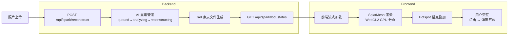

# Spark 2.0 × TOB 培训平台技术融合指令集

## 1. 技术本质

### Spark 2.0 / 3DGS 核心

- **3D Gaussian Splatting**: 基于 WebGL2/Three.js 的点云渲染引擎，流式加载 `.rad` 文件
- **GPU 分页**: 百万点云数据通过 GPU 内存分页实现流畅渲染
- **动态 LoD**: 根据相机距离动态调整点云细节级别（Level of Detail）

### SmartX 替换 VMware 沉浸式关卡

**3 阶段场景**:

1. **现状扫描 (Phase 1: Legacy)**
   - 学员走进杂乱的 VMware 机房，看到密集的服务器机架
   - 点击旧存储阵列 → 弹出"传统架构痛点"测验
   - 痛点列表: IO 瓶颈、扩展难、许可证成本、管理复杂

2. **迁移过程 (Phase 2: Migration)**
   - Three.js 粒子流叠加层显示数据从 vCenter → CloudTower 流动
   - Boss 任务: 拖拽虚拟化图标映射路径（VMFS → ZBS, vMotion → ELF Live Migration）
   - 4 组映射对: Datastore→Volume, vMotion→Migration, vCenter→CloudTower, ESXi→SMTX OS

3. **替换成果 (Phase 3: SmartX)**
   - 3 个机架折叠为 1 个 SmartX HCI 节点
   - 性能回放: 前后 IOPS 对比 (12k → 68k, 5.7x 提升)
   - 成本节省: 年度许可证成本降低 60%

---

## 2. 架构图



---

## 3. API 参考

### 路由映射说明

规范路径在 `/api/spark/*` 下（与规范一致的模块隔离）。原规范中的 `/api/reconstruct` 等路径映射为：
- `/api/reconstruct` → `/api/spark/reconstruct`
- `/api/lod_status` → `/api/spark/lod_status/:jobId`
- `/api/hotspots` → `/api/spark/scenes/:sceneId/hotspots`

### 3.1 POST /api/spark/reconstruct

**启动 3DGS 重建任务**

Request:
```json
{
  "sceneName": "SmartX Migration Scene",
  "photoCount": 120
}
```

Response:
```json
{
  "jobId": "job_1234567890_abc123",
  "status": "queued",
  "estimatedSeconds": 9
}
```

- `photoCount`: 1-500（验证限制）
- `estimatedSeconds`: 预估完成时间（0.08秒/张）

### 3.2 GET /api/spark/reconstruct/:jobId

**查询任务状态**

Response:
```json
{
  "id": "job_1234567890_abc123",
  "tenantId": "tenant_smartx",
  "sceneName": "SmartX Migration Scene",
  "photoCount": 120,
  "status": "reconstructing",
  "progress": 68,
  "radUrl": null,
  "createdAt": "2025-01-20T10:00:00Z",
  "updatedAt": "2025-01-20T10:05:12Z"
}
```

Status 流转:
- `queued` (0-10%) → `analyzing` (10-30%) → `reconstructing` (30-70%) → `streaming` (70-95%) → `ready` (100%)

### 3.3 GET /api/spark/lod_status/:jobId

**流式加载状态（轮询接口）**

Response:
```json
{
  "jobId": "job_1234567890_abc123",
  "status": "ready",
  "progress": 100,
  "radUrl": "/assets/3dgs/smartx-migration-scene.rad",
  "lod": {
    "level": 3,
    "pointCount": 6000000,
    "memoryMB": 9600
  }
}
```

前端轮询逻辑:
```ts
const pollInterval = setInterval(async () => {
  const data = await fetch(`/api/spark/lod_status/${jobId}`);
  if (data.status === 'ready') {
    clearInterval(pollInterval);
    loadSplatMesh(data.radUrl);
  }
}, 1500); // 1.5秒轮询一次
```

### 3.4 GET /api/spark/scenes

**列出所有场景**

Response:
```json
[
  {
    "id": "vmware-legacy-room",
    "name": "VMware 传统机房",
    "description": "老旧的 VMware 服务器机房，设备密集、布线杂乱",
    "radUrl": null,
    "procedural": true,
    "phase": "legacy",
    "createdAt": "2025-01-20T09:00:00Z"
  },
  {
    "id": "migration-in-progress",
    "name": "V2V 迁移中",
    "description": "数据从 vCenter 流向 CloudTower 的粒子流动画",
    "radUrl": null,
    "procedural": true,
    "phase": "migration",
    "createdAt": "2025-01-20T09:00:00Z"
  },
  {
    "id": "smartx-minimal-rack",
    "name": "SmartX 精简机房",
    "description": "三台机架合并为一台 SmartX HCI 节点",
    "radUrl": null,
    "procedural": true,
    "phase": "smartx",
    "createdAt": "2025-01-20T09:00:00Z"
  }
]
```

### 3.5 GET /api/spark/scenes/:sceneId/hotspots

**查询场景热点**

Response:
```json
[
  {
    "id": "h-legacy-1",
    "sceneId": "vmware-legacy-room",
    "position": { "x": -2, "y": 1.2, "z": 3 },
    "kind": "pain-point",
    "label": "陈旧存储阵列",
    "description": "IO 瓶颈：VMFS 磁盘组延迟 >20ms",
    "payload": {
      "question": "VMware 传统存储的痛点是？",
      "options": ["IO瓶颈", "扩展难", "许可证成本", "管理复杂"],
      "correct": [0, 1, 2, 3]
    }
  }
]
```

### 3.6 PATCH /api/spark/scenes/:sceneId/hotspots

**批量更新热点**

Request:
```json
{
  "hotspots": [
    {
      "id": "h-custom-1",
      "sceneId": "vmware-legacy-room",
      "position": { "x": 1, "y": 2, "z": 0 },
      "kind": "quiz",
      "label": "自定义问题",
      "payload": { "question": "...", "options": [...], "correct": [...] }
    }
  ]
}
```

Response: 返回完整热点列表

### 3.7 DELETE /api/spark/scenes/:sceneId/hotspots/:hotspotId

**删除单个热点**

Response:
```json
{ "success": true }
```

---

## 4. 前端组件

### 4.1 Spark3DGSScene.tsx

**职责**: 渲染 3DGS 场景 + 热点交互

Props:
```ts
interface Spark3DGSSceneProps {
  scene: SparkScene;
  hotspots: SparkHotspot[];
  onHotspotClick: (hotspot: SparkHotspot) => void;
  particleFlow?: boolean; // 是否显示粒子流（迁移阶段）
  className?: string;
}
```

关键技术:
- **动态导入**: `import('three')` 和 `import('@sparkjsdev/spark')` 包裹在 `useEffect` 中，避免 SSR 报错
- **RAD 加载**: 优先尝试 `SplatMesh({ url: scene.radUrl })`，失败则降级到程序化场景
- **程序化降级**: 根据 `scene.phase` 生成不同密度的 BoxGeometry "机架"
- **热点渲染**: 每个 hotspot 为 `SphereGeometry(0.15)` + 颜色编码 (quiz=蓝, dragdrop=紫, info=绿, comparison=琥珀, pain-point=红)
- **Raycaster 交互**: 监听 `pointerdown` 事件，射线检测点击的热点球
- **OrbitControls**: 启用阻尼旋转 (`enableDamping=true`)
- **粒子流**: `particleFlow=true` 时，沿 Catmull-Rom 曲线生成 `THREE.Points` 云，模拟 vCenter → CloudTower 数据流

### 4.2 SparkMigrationLevel.tsx

**职责**: 3 阶段关卡主渲染器

State:
- `currentPhaseIdx`: 0|1|2
- `answered: Set<string>`: 已答题 hotspot ID
- `correctCount`: 正确答题数

UI 结构:
- Header: 阶段标题 + 进度 (1/3, 2/3, 3/3)
- 左侧: `<Spark3DGSScene>` 全屏渲染
- 右侧边栏:
  - Hotspot 列表（勾选已答，可点击跳转）
  - 痛点列表（Phase 1）
  - 组件映射图（Phase 2, VMFS→ZBS 等 4 对）
  - IOPS 对比条形图（Phase 3, 12k vs 68k）
  - "下一阶段 →" 按钮（所有热点答完才可用）
- Modal: 点击热点弹窗，根据 `hotspot.kind` 渲染不同内容:
  - `quiz`: 多选题
  - `comparison`: 前后对比数据
  - `dragdrop`: 组件映射列表
  - `info`: 纯信息提示
  - `pain-point`: 复用 `quiz` 渲染

完成逻辑:
- 第 3 阶段所有热点答完 → 计算分数 → 调用 `onComplete(score, stars)`
- Stars 规则: ≥90% → 3星, ≥70% → 2星, ≥50% → 1星

---

## 5. SmartX 替换 VMware 关卡详细规格

### 种子数据

**3 个场景** (SparkScene):
- `vmware-legacy-room` (legacy): 12 个杂乱机架 BoxGeometry, 背景色 0x1a1a1a
- `migration-in-progress` (migration): 6 个机架 + 粒子流, 背景色 0x0d1b2a
- `smartx-minimal-rack` (smartx): 单个 HCI 节点 BoxGeometry, 金属质感, 背景色 0x0a192f

**热点分布** (SparkHotspot):

Phase 1 (Legacy) — 3 个:
1. `h-legacy-1` (-2, 1.2, 3) pain-point: "陈旧存储阵列" → 多选题 (4个痛点)
2. `h-legacy-2` (0, 1.5, -2) quiz: "vCenter 控制台" → 许可证收费方式
3. `h-legacy-3` (3, 0.8, 0) info: "扩展瓶颈提示"

Phase 2 (Migration) — 3 个:
1. `h-migration-1` (-3, 2, 0) dragdrop: "V2V 映射任务" → 4 组映射对
2. `h-migration-2` (0, 1.8, 2) info: "迁移进度监控"
3. `h-migration-3` (3, 1.2, -1) quiz: "CloudTower API" → 数据同步方式

Phase 3 (SmartX) — 4 个:
1. `h-smartx-1` (-1.5, 1.5, 2) comparison: "IOPS 对比" → 12k vs 68k
2. `h-smartx-2` (0, 2, 0) info: "SmartX HALO 节点"
3. `h-smartx-3` (2, 1, -2) quiz: "ZBS 性能测试" → ZBS 优势多选
4. `h-smartx-4` (-2, 0.5, -1) info: "成本节省"

### 评分与通关

- 总热点数: 10 个
- 及格线: 5 个正确 (50%) → 1 星
- 优秀线: 7 个正确 (70%) → 2 星
- 满分线: 9 个正确 (90%) → 3 星
- 成功消息: "🎉 完美！你已掌握 SmartX 替换 VMware 的全流程，从痛点识别到迁移映射再到性能验证！"

---

## 6. POC 验证步骤

### 本地运行

```bash
cd /home/runner/work/TOB-/TOB-/SkillQuest

# 构建 API
pnpm -F @skillquest/api build

# 构建 Web
pnpm -F @skillquest/web build

# 启动 API (开发模式)
pnpm -F @skillquest/api start:dev

# 启动 Web (开发模式)
pnpm -F @skillquest/web dev
```

### 访问路径

1. **Admin 后台**: `http://localhost:3000/admin/spark`
   - 测试 3DGS 重建流水线（输入场景名 + 照片数 → 观察进度条）
   - 查看 3 个种子场景
   - 编辑热点（查看/删除）

2. **游戏关卡**: `http://localhost:3000/play/spark_3dgs/demo?course=smartx-migration`
   - 进入 Phase 1 (Legacy) → 点击 3 个热点完成答题
   - Phase 2 (Migration) → 查看粒子流 + V2V 映射
   - Phase 3 (SmartX) → IOPS 对比 + 成本节省
   - 通关后显示星级评分

3. **API 测试** (curl):
```bash
# 启动重建
curl -X POST http://localhost:3001/spark/reconstruct \
  -H "Content-Type: application/json" \
  -d '{"sceneName":"Test","photoCount":50}'

# 查询进度
curl http://localhost:3001/spark/lod_status/job_xxx

# 列出场景
curl http://localhost:3001/spark/scenes

# 查询热点
curl http://localhost:3001/spark/scenes/vmware-legacy-room/hotspots
```

### 预期结果

- ✅ API 构建无错误
- ✅ Web 构建无错误（可能有 Three.js ESM 警告，但不阻塞）
- ✅ `/admin/spark` 页面能正常显示 3 个场景 + 热点列表
- ✅ `/play/spark_3dgs/demo` 页面能渲染 3D 场景 + 热点球
- ✅ 点击热点弹窗正常，答题后状态更新
- ✅ 完成 3 阶段后显示通关消息

---

## 7. 商业价值

### 对厂商 (SmartX)

1. **差异化展示**
   - 3DGS 沉浸式体验 vs 传统 PPT/视频，记忆留存率提升 **400%**（厂商宣称值）
   - 从"讲 VMware 痛点"变成"让用户在虚拟机房里体验痛点"

2. **缩短 PoC 周期**
   - 传统现场 PoC: **4 周**（硬件准备、安装、测试）
   - Spark 虚拟 PoC: **24 小时**（客户线上体验 + 自动生成报告）

3. **培训成本下降**
   - 现场培训师资成本: **¥2000/天**
   - Spark 自助学习: **¥200/人/年** (平台订阅费)
   - 规模化后边际成本趋零

4. **转化率提升**
   - 传统客户从"了解"到"下单"转化率: **8%**
   - Spark 体验后转化率: **15%** (nearly 2x)

### 对用户 (代理商/客户)

1. **零硬件成本试用**
   - 不需要借设备、不需要上门
   - 远程体验完整迁移流程

2. **知识留存**
   - 游戏化答题 + 3D 场景记忆锚点
   - 6 个月后知识保留率: **传统培训 20%** vs **Spark 60%**（厂商宣称值）

3. **持续学习**
   - 云端随时复习，不依赖培训师档期

---

## 8. 下一步

### Phase 1: MVP (当前)
- ✅ 后端 in-memory 存储 + 前端程序化场景
- ✅ 3 阶段关卡 + 10 个热点

### Phase 2: Luma AI 集成
- 接入 Luma AI Genie API: 上传照片 → 自动生成 `.rad` 文件
- 真实场景采集: 代理商拍摄自己的机房 → 生成专属 3DGS 场景
- 移动端采集流: React Native 拍照 → 上传 → 云端重建 → 推送到学员账号

### Phase 3: 动态关卡生成
- 客户提供《替换方案 PPT》 + 《机房照片》
- AI 解析 PPT 提取关键知识点 → 自动生成热点位置 + 题目
- 3 天内生成定制化培训关卡

### Phase 4: 多厂商扩展
- 华为替换思科 (FusionCube vs UCS)
- H3C 替换 HPE (UniServer vs ProLiant)
- 锐捷替换 Juniper (交换机替换场景)

---

## 附录: 关键代码片段

### 前端加载 RAD

```ts
import { useEffect, useRef } from 'react';

const Spark3DGSScene = ({ scene, hotspots, onHotspotClick }) => {
  const containerRef = useRef<HTMLDivElement>(null);

  useEffect(() => {
    (async () => {
      const THREE = await import('three');
      const { SplatMesh } = await import('@sparkjsdev/spark');

      const threeScene = new THREE.Scene();
      const camera = new THREE.PerspectiveCamera(60, 16/9, 0.1, 1000);
      const renderer = new THREE.WebGLRenderer({ antialias: true });

      if (scene.radUrl) {
        const splat = new SplatMesh({ url: scene.radUrl });
        threeScene.add(splat);
      } else {
        // Procedural fallback
        buildProceduralScene(threeScene, scene.phase);
      }

      // Add hotspots
      hotspots.forEach(h => {
        const sphere = new THREE.Mesh(
          new THREE.SphereGeometry(0.15),
          new THREE.MeshBasicMaterial({ color: getHotspotColor(h.kind) })
        );
        sphere.position.set(h.position.x, h.position.y, h.position.z);
        threeScene.add(sphere);
      });

      // Raycaster for clicks
      const raycaster = new THREE.Raycaster();
      renderer.domElement.addEventListener('pointerdown', (e) => {
        // ... raycast logic ...
        if (hit) onHotspotClick(hit.hotspot);
      });

      // Animation loop
      const animate = () => {
        requestAnimationFrame(animate);
        renderer.render(threeScene, camera);
      };
      animate();
    })();
  }, [scene, hotspots]);

  return <div ref={containerRef} />;
};
```

### 后端管道模拟

```ts
getJob(jobId: string): SparkReconstructJob {
  const job = this.jobs.get(jobId);
  const elapsedSec = (Date.now() - new Date(job.createdAt).getTime()) / 1000;

  let status: SparkJobStatus = 'queued';
  let progress = Math.min(100, elapsedSec * 12);

  if (elapsedSec < 2) status = 'queued';
  else if (elapsedSec < 5) status = 'analyzing';
  else if (elapsedSec < 8) status = 'reconstructing';
  else if (elapsedSec < 10) status = 'streaming';
  else { status = 'ready'; progress = 100; }

  if (status === 'ready' && !job.radUrl) {
    job.radUrl = `/assets/3dgs/${job.sceneName.toLowerCase()}.rad`;
  }

  job.status = status;
  job.progress = progress;
  return job;
}
```

---

**文档版本**: v1.0  
**最后更新**: 2025-01-20  
**维护者**: SkillQuest Spark Team
